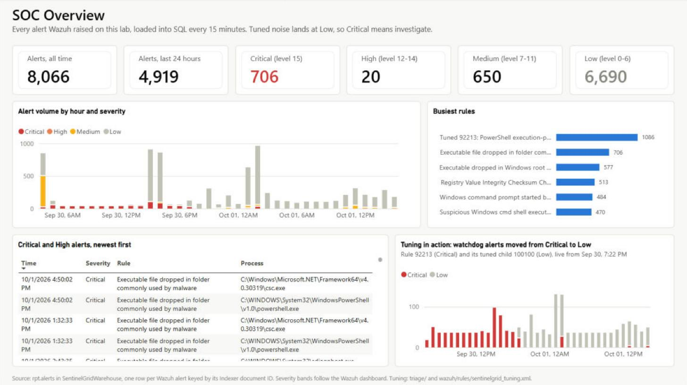
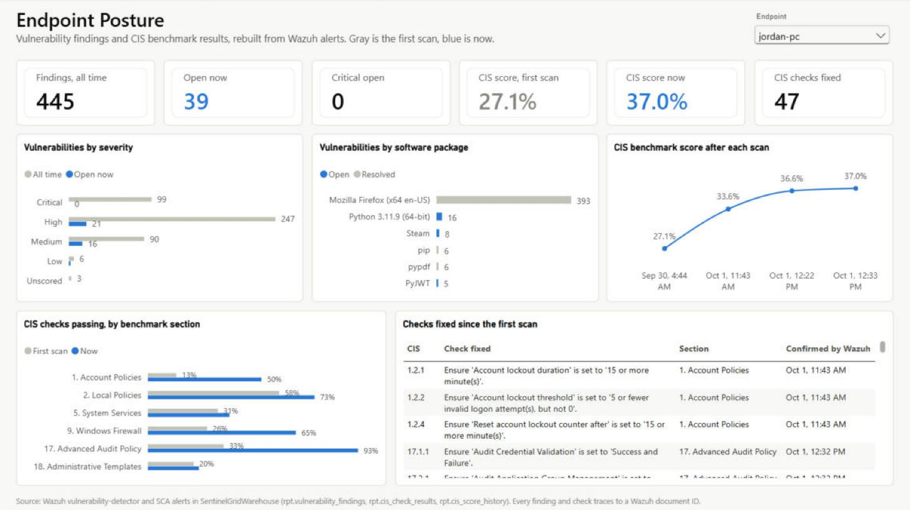
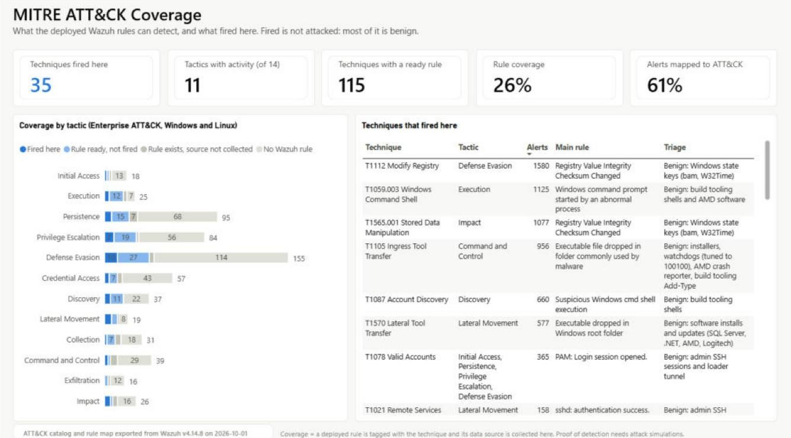
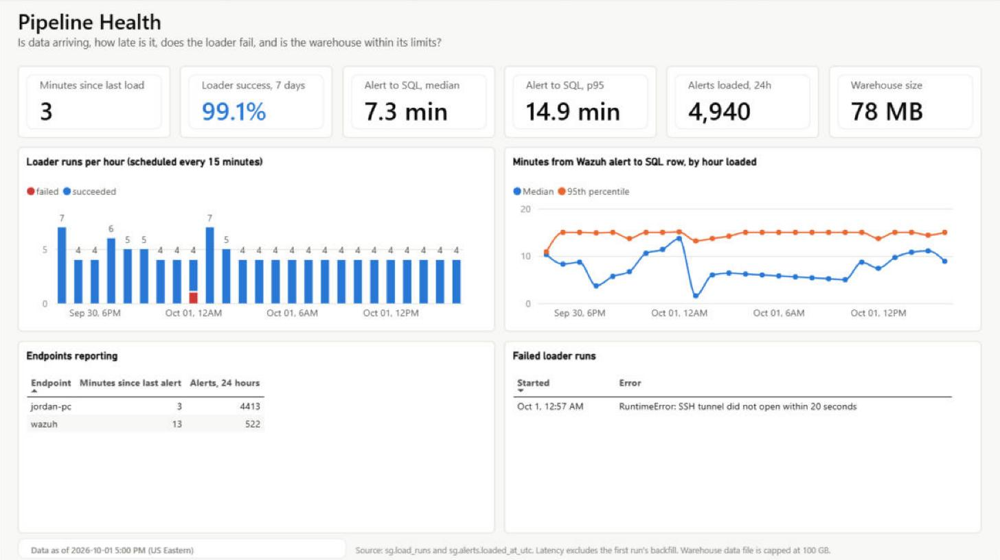
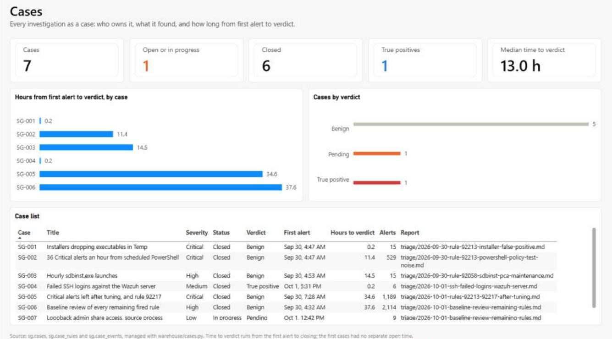
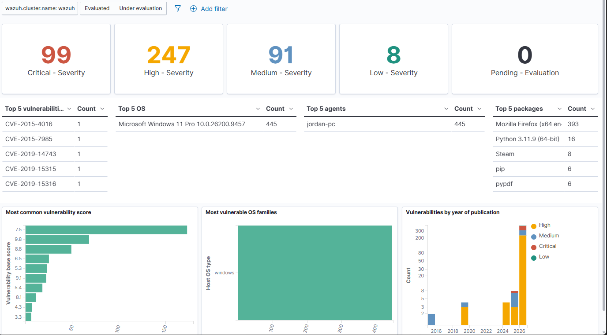
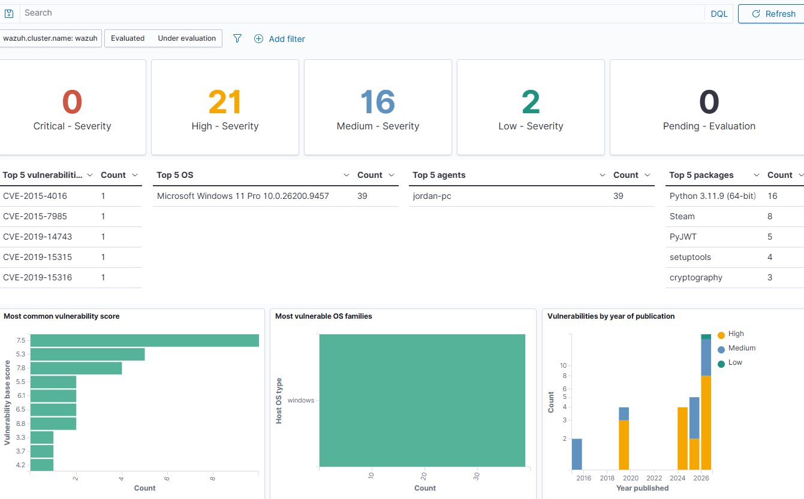
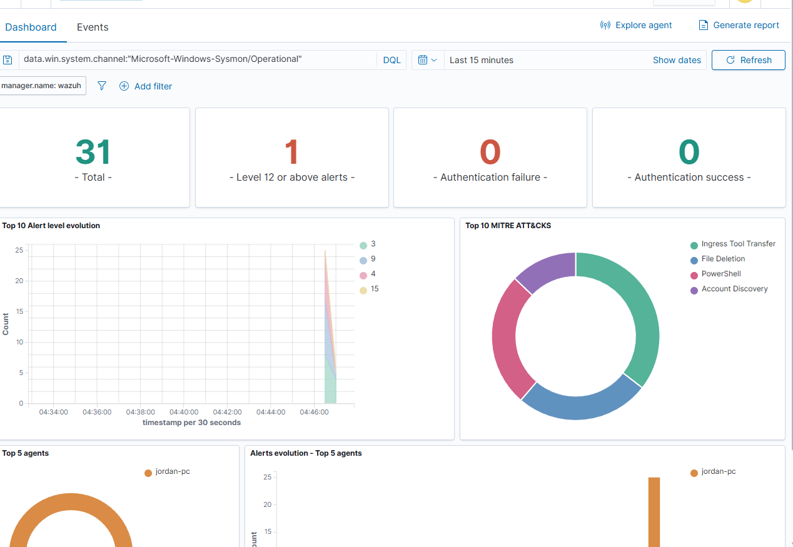

# SentinelGrid: A Home SOC Built on Wazuh, SQL Server and Power BI

SentinelGrid is a working security operations lab: a Windows endpoint instrumented with Sysmon, monitored by a self-hosted Wazuh SIEM, with alerts loaded into a SQL Server warehouse and reported in Power BI. It was built, broken, fixed, hardened and tuned by hand, and every step is documented.

**Author:** Jordan Carven-Bellace



## Highlights

- **End-to-end detection pipeline.** Sysmon telemetry from a Windows 11 host flows through a Wazuh agent to a Wazuh manager, indexer and dashboard running in a hardened Ubuntu VM.
- **Real triage, written up.** Five investigations covering every rule behind a fired ATT&CK technique, each traced to a root cause with evidence, a verdict and the residual risk of any tuning (including why one technique was deliberately left untuned), plus a controlled password-guessing test detected end to end. See [triage/](triage/).
- **Detection tuning that was tested before deployment.** Two child rules lower proven noise to level 3 without disabling the parent detections. Before going live, they were replayed against 674 stored alerts: every noise event matched and every real installer event still fired.
- **94% of Critical alerts eliminated as noise**, so a genuine Critical stands out. The activity is still recorded, just at the right severity.
- **Vulnerability findings cut from 445 to 39, and Critical from 99 to 0.** Removing one forgotten, unused browser cleared 88% of them.
- **A data warehouse that found what the SIEM dashboard hid.** Aggregating alerts in SQL exposed a flat 36-per-hour stream of level 15 alerts from scheduled automation, which led to the second triage report.
- **Posture and coverage reported from evidence.** The Power BI pages rebuild the vulnerability and CIS "before" numbers from Wazuh's own alerts, and map ATT&CK coverage three ways: techniques with a ready rule (115 of 447 for Windows and Linux), techniques that fired here (33), and what is still missing.
- **Least-privilege data access.** The loader reads Wazuh through an SSH tunnel with a key restricted to a single port forward (no shell), using a read-only indexer account and TLS verified against the Wazuh root CA. The indexer is never exposed on the network.

## Architecture

```text
Windows 11 endpoint (jordan-pc)
  Sysmon (SwiftOnSecurity config) -> Windows Event Log
  Wazuh agent ----------------------------------------+  TCP 1514/1515
                                                      v
Hyper-V VM: Ubuntu Server 24.04, ufw default-deny
  Wazuh manager -> Filebeat -> Wazuh indexer -> Wazuh dashboard (HTTPS 443)
                                     ^ 127.0.0.1:9200 only
                                     | SSH tunnel, restricted key
Windows host                         |
  Task Scheduler, every 15 min:  loader/wazuh_to_sql.py (Python 3.14)
                                     |
                                     v
  SQL Server 2025: SentinelGridWarehouse
    sg.*  tables (alerts, agents, rules, MITRE, vulnerability snapshots, load runs)
    rpt.* views  ->  Power BI Desktop (4 pages, kept as code in powerbi/)
```

## What is in this repo

| Path | What it is |
|---|---|
| [SentinelGrid-Build-Runbook.md](SentinelGrid-Build-Runbook.md) | Stage-by-stage build guide with completion gates, revised with every lesson from the real build |
| [BUILD-LOG.md](BUILD-LOG.md) | What actually happened: timeline, seven problems hit and how each was solved, open items |
| [triage/](triage/) | Alert investigation reports |
| [wazuh/rules/sentinelgrid_tuning.xml](wazuh/rules/sentinelgrid_tuning.xml) | Custom Wazuh rules deployed to the manager |
| [warehouse/](warehouse/) | Idempotent SQL Server schema, reporting views and the script that applies them; `cases.py` opens, assigns and closes cases with a full history |
| [loader/](loader/) | Incremental Wazuh-to-SQL loader and its settings template |
| [powerbi/](powerbi/) | Power BI report as a project: model (TMDL) and pages (PBIR) in Git, imported data excluded. Pages 2-4 are generated by [powerbi/tools/](powerbi/tools/) |
| `Enable-SentinelGridHyperV.ps1`, `Create-SentinelGridWazuhVM.ps1` | Host preparation and VM creation |
| `dist/` | Early SentinelGrid web console prototype. It currently runs on **generated demo data**; connecting it to live Wazuh data is Stage 6 of the roadmap. |

## Triage reports

| Report | Rule | Verdict |
|---|---|---|
| [Installer false positives](triage/2026-09-30-rule-92213-installer-false-positive.md) | 92213, level 15 | Benign: Wazuh agent and Sysmon installers writing to Temp |
| [PowerShell policy-test noise](triage/2026-09-30-rule-92213-powershell-policy-test-noise.md) | 92213, level 15 | Benign: scheduled watchdogs starting PowerShell 36 times an hour. Tuned. |
| [sdbinst / Program Compatibility Assistant](triage/2026-09-30-rule-92058-sdbinst-pca-maintenance.md) | 92058, level 12 | Benign: Microsoft-signed hourly Windows maintenance (looks like T1546.011). Tuned. |
| [Critical alerts left after tuning, and rule 92217](triage/2026-10-01-rules-92213-92217-after-tuning.md) | 92213, level 15; 92217, level 6 | Benign: AMD crash reporter after GPU driver crashes, build tooling compiling with `Add-Type` (kept Critical), installs and updates |
| [Baseline review of every remaining fired rule](triage/2026-10-01-baseline-review-remaining-rules.md) | 28 rules, levels 3-14 | 27 benign with a named source; 1 low risk, source not confirmed. Every fired ATT&CK technique now has a verdict. |
| [Failed SSH logins on the Wazuh server](triage/2026-10-01-ssh-failed-logins-wazuh-server.md) | 5710, 5760, 2502 (level 10) | True positive, controlled test of T1110.001. Detected end to end; one threshold gap documented. |

## Security design

| Control | Implementation |
|---|---|
| Network exposure | VM on Hyper-V's NAT Default Switch, no port forwarding. `ufw` denies inbound by default and allows only 22, 443 and 1514-1515 from private address ranges. The indexer (9200) and API (55000) are not reachable from outside the VM. |
| Credentials | Installer-generated admin password rotated. A dedicated read-only indexer account for the loader. Secrets live in a git-ignored `.env` and a private backup outside the repo. |
| Loader access | SSH key limited in `authorized_keys` to `permitopen="127.0.0.1:9200"` with `command="/bin/false"`. Verified that it cannot run commands. |
| Transport | TLS verified against the Wazuh root CA, with hostname checking on. Only Python's strict-mode flag is relaxed, because the installer's CA lacks a keyUsage extension; a wrong-hostname test is still rejected. |
| Recovery | Hyper-V checkpoints at known-good points. |
| Data hygiene | The Power BI file, which embeds alert data, is kept out of Git. |

## Results

| Measure | Before | After |
|---|---|---|
| Vulnerability findings | 445 (99 Critical, 247 High) | 39 (0 Critical, 21 High) |
| CIS Windows 11 benchmark score | 27.1% | 37.0% (47 fixes, every remaining gap documented) |
| Level 15 alerts per hour from known noise | about 36 | 0 (now level 3) |
| Level 12 alerts per hour from known noise | 1 | 0 (now level 3) |
| Alert history | Wazuh dashboard only | Every alert in SQL, keyed to its Indexer document ID, refreshed every 15 minutes |

## Screenshots

### Power BI

| | |
|---|---|
|  |  |
| **SOC Overview:** alert volume by severity, the newest Critical and High alerts, and tuning in action: watchdog noise moving from Critical to Low the hour the custom rule went live | **Endpoint Posture:** vulnerabilities 445 to 39 and CIS 27.1% to 37.0%, every number traced to a Wazuh alert |
|  |  |
| **ATT&CK Coverage:** what the deployed rules can detect, what fired here, and the triage verdict behind it | **Pipeline Health:** data freshness, loader success, alert-to-SQL latency, warehouse size |
|  | |
| **Cases:** every investigation as a case with an owner, a verdict and its time from first alert to verdict (median 13.0 hours) | |

### Wazuh

| | |
|---|---|
|  |  |
| Vulnerabilities before cleanup | Vulnerabilities after cleanup |
|  | |
| First Sysmon alerts, mapped to MITRE ATT&CK | |

## Roadmap

- [x] Stages 0-4: lab, Wazuh, Sysmon, agent, first event path
- [x] Stage 7: SQL Server warehouse, scheduled loader and case log (open, assign, close, history)
- [x] Detection tuning with tested custom rules
- [x] Stage 4: controlled test that traces one event through every layer ([docs/event-trace.md](docs/event-trace.md))
- [x] Stage 4b: CIS benchmark baseline and hardening ([docs/cis-baseline.md](docs/cis-baseline.md))
- [x] Stage 8: Power BI pages for posture, MITRE ATT&CK coverage and pipeline health
- [x] Least-privilege reporting role, tested: reads `rpt` views, blocked from raw tables and from any change (SQL Server stays Windows-authentication only, so no SQL passwords exist)
- [ ] Alert notifications for level 12 and above
- [x] File Integrity Monitoring with who-did-it attribution on secrets, scheduled automation scripts and autostart locations
- [x] Full event archive with tiered retention at every layer
- [x] Collect Windows Defender logs (first full and offline scans recorded)
- [x] Collect PowerShell script block logs (event 4104, deobfuscated)
- [ ] Attack simulations (Atomic Red Team) with a detection coverage map
- [ ] Stage 6: SentinelGrid API and console on live Wazuh data, with incident tracking
- [ ] Stage 5: Suricata network telemetry

## Tools

Wazuh 4.14 · Sysmon · Ubuntu Server 24.04 · Hyper-V · SQL Server 2025 Developer · Python 3.14 (pyodbc, requests) · Power BI Desktop · PowerShell · ufw · OpenSSH

## Copyright

© 2026 Jordan Carven-Bellace. All rights reserved. The code and write-ups are shared to be read and evaluated; no license to reuse them is granted.
